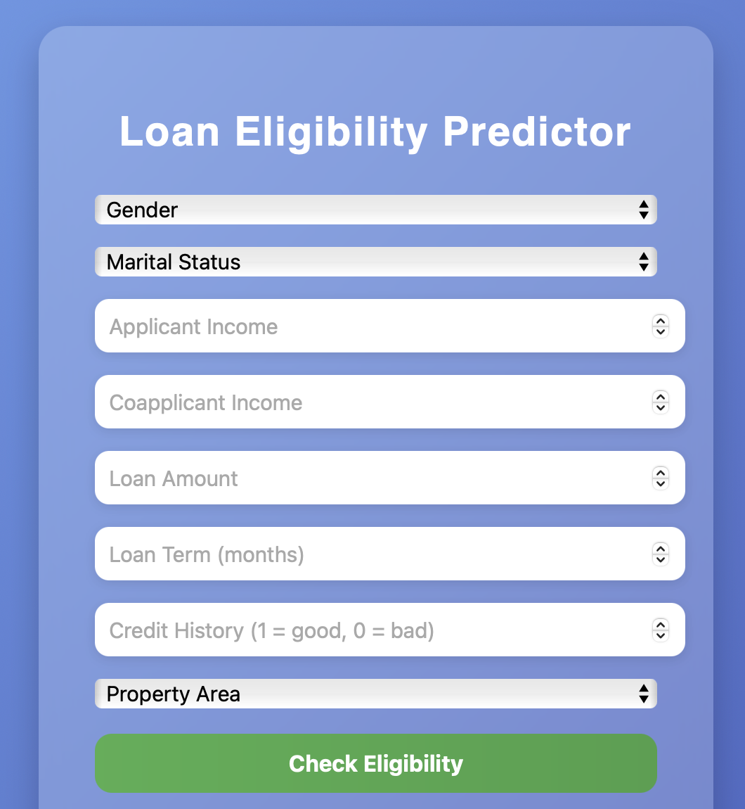

## Loan Eligibility Predictor

Web application predicts whether a loan application is likely to approved or rejected
based on user details.

### Data Used:
[**Kaggle - Loan Prediction Dataset**](https://www.kaggle.com/datasets/ninzaami/loan-predication)

### Model:
* Python (scikit-learn, pandas, numpy)
* Algorithm: Logistic Regression
* StandardScaler used for feature normalization
* Model and scaler saved using joblib
* The trained model and preprocessing objects are saved in the `/model/` folder as:
- `loan_model.pkl`
- `scaler.pkl`
- `label_encoder.pkl`
- **These files are automatically generated when you run `python model.py`**

### Backend:
* Flask REST API
* Flask-CORS for cross-origin request
* **Database:** SQLite for storing user prediction history
* `loan_predictions.db` auto generated when you run: `init_db.py`

### FrontEnd:
* HTML,CSS, JavaScript
* Sends backend API to the user with `fetch()` Post request
* Displays the decision(approval/rejection) and probability instantly

### Installation
1. Install dependencies: `pip install -r requirements.txt`
2. Train model: `model.py`
3. create database : `init_db.py`
4. backend server: `app.py`
5. open `index.html` in browser

### Future Improvements:
Migrate database from SQLite to MongoDB
Deploy backend using Render, Railway, or AWS Lambda

### ScreenShots:
* **Default Interface**

* **Approved**

* **Rejected**

#### Example Input:
- Gender: Male
- Married: Yes
- Income: 5000
- Coapplicant Income: 2000
- Loan Amount: 100 as in (100.000)
- Loan Term: 360 months
- Credit History: 1 #0
- Property Area: Urban

* **probability(example_input) ~= 85%**

- Combined income = 7000
- Loan amount = 100 ~= 14 x monthly income
- Clean credit history
- Stable urban area
